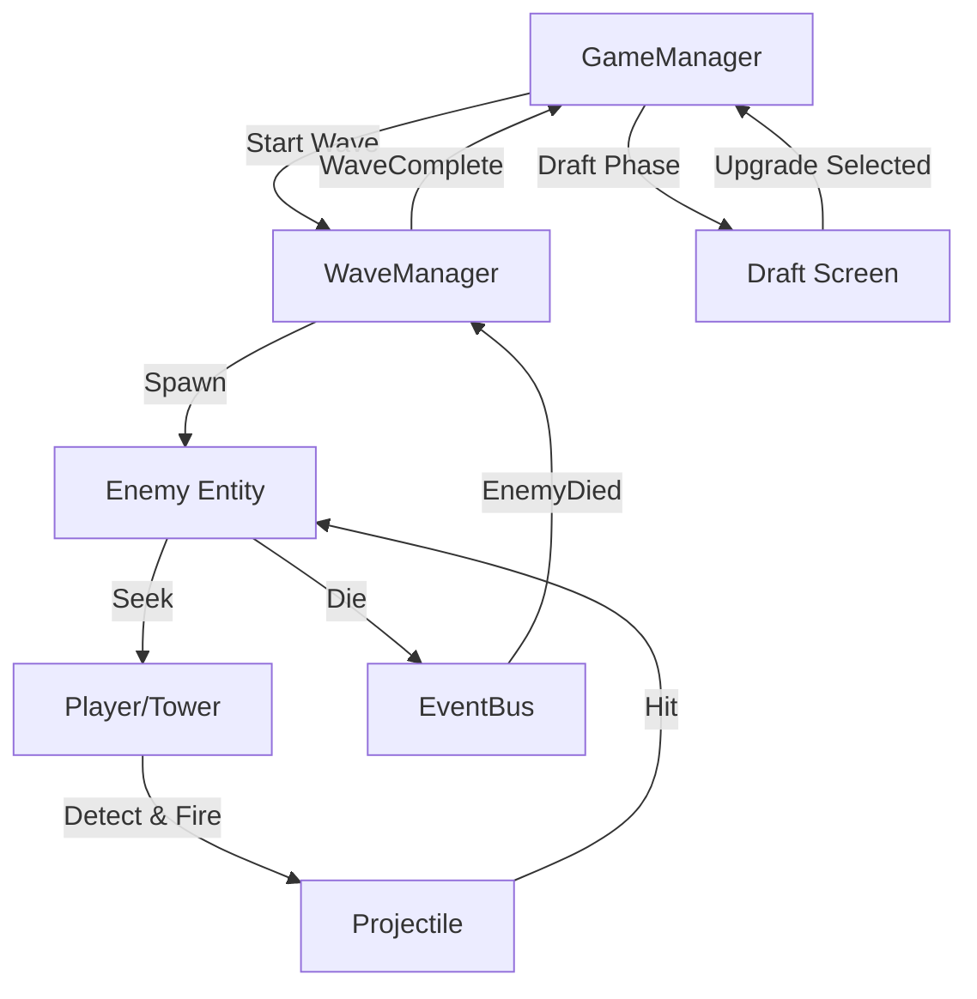

# Visão Geral da Arquitetura do Rogue-Defense

Este documento descreve a arquitetura de alto nível do Rogue-Defense, focando no padrão Entity-Component-System (ECS) e no fluxo de dados.

---

## 🏗️ Padrões Principais

### 1. ECS-Híbrido (Entity-Component-System)
O Rogue-Defense usa uma abordagem ECS pragmática, adequada para o Godot:
-   **Entities**: Objetos `Node2D` (Cenas) que agem como contêineres (ex.: `Player`, `BaseEnemy`).
-   **Components**: Scripts `Node` que lidam com lógicas específicas (ex.: `HealthComponent`, `MovementComponent`).
-   **Systems**: Gerenciadores Globais ou Nós dedicados que orquestram a lógica do jogo (ex.: `WaveManager`, `GameManager`).

### 2. Comunicação Orientada a Eventos (`EventBus`)
Sistemas e Entidades se comunicam principalmente através do autoload global `EventBus` para evitar acoplamento forte.
-   **Chamadas Diretas**: Permitidas de Pai -> Filho (ex.: Inimigo -> MovementComponent).
-   **Sinais**: Obrigatórios de Filho -> Pai ou Irmão -> Irmão.
-   **EventBus**: Obrigatório para comunicação Global (ex.: Inimigo Morreu -> WaveManager).

---

## 🧩 Diagramas de Sistema

### A. Fluxo do Loop de Jogo

### B. Composição da Entidade
**Player (Torre)**
-   `Actor` (Base)
-   `HealthComponent` (Invulnerabilidade/HP)
-   `TowerCombatComponent` (Mira Automática)
-   `RangeArea` (Area2D de Detecção)
-   `CollisionShape2D` (Corpo Estático)

**Enemy**
-   `Actor` (Base)
-   `HealthComponent` (HP/Morte)
-   `MovementComponent` (Velocidade Radial)
-   `HurtboxComponent` (Receber Dano)
-   `EnemySnapshot` (Recurso de Dados: Status)

---

## 💾 Arquitetura de Dados (`SnapshotLoader`)

O jogo utiliza um **Sistema de Dados Híbrido**:
1.  **Dados Legados (`data/legacy_data/`)**: Espelha a estrutura do projeto antigo. Contém scripts estilo JSON para NPCs.
2.  **Resources (`resources/`)**: Arquivos `.tres` do Godot para conteúdo novo (Inimigos, provavelmente Skills).
3.  **SnapshotLoader**: Um Singleton que une ambos. Ele escaneia diretórios na inicialização e provê uma API unificada (`get_enemy()`, `get_all_npcs()`).

**Fluxo de Inicialização:**
1.  `SnapshotLoader._ready()` -> Escaneia `res://data/legacy_data/` e `res://resources/`.
2.  Popula arrays internos (`enemy_snapshots`, `npc_data`).
3.  `WaveManager._ready()` -> Solicita lista de Inimigos ao `SnapshotLoader`.

---

## 🎛️ Sistemas Chave

### 1. WaveManager
-   **Responsabilidade**: Spawna inimigos em um padrão radial.
-   **Configuração**:
    -   `spawn_radius`: Distância do centro.
    -   `possible_enemies`: Lista de `EnemySnapshot` para spawnar.
-   **Lógica**: Aumenta a dificuldade (contagem) linearmente com o número da onda (Atualmente `wave * 2 + 3`).

### 2. TowerCombatComponent
-   **Responsabilidade**: Lida com o ataque da Torre.
-   **Lógica**:
    -   Usa uma `Area2D` para manter uma lista de alvos.
    -   Seleciona o alvo **mais próximo** a cada frame.
    -   Instancia `BaseProjectile` apontando para o alvo.

### 3. GameManager
-   **Responsabilidade**: Máquina de estado de alto nível.
-   **Estados**: `Menu`, `Running`, `paused` (Draft), `GameOver`, `Victory`.
-   **Sinais**: `game_over`, `game_won`.

---

## 🧪 Estratégia de Testes
-   **Testes Unitários**: Localizados em `tests/unit/`. Use o framework `GUT`.
-   **Cena de Integração**: `view/scenes/TestLevel.tscn`.
-   **Teclas de Debug**:
    -   `F6`: Executar cena atual.
    -   `Debug UI`: Botões no TestLevel para forçar início de onda.
